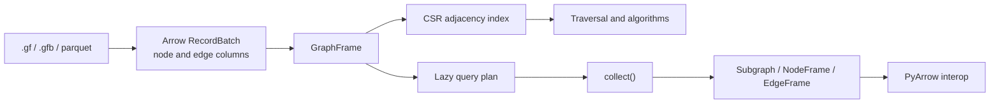

<h1 align="center">Lynxes</h1>

<p align="center">
  <strong>A Fast, Zero-Copy Graph Analytics Engine Built Natively on Apache Arrow.</strong>
</p>

<p align="center">
  <a href="https://pypi.org/project/lynxes/"></a>
  
  
  
</p>

<p align="center">
  <a href="#why-lynxes">Why Lynxes</a> |
  <a href="#quickstart">Quickstart</a> |
  <a href="#api-overview">API Overview</a> |
  <a href="#architecture">Architecture</a>
</p>

`Lynxes` is a blazingly fast, lazy-evaluated graph analytics engine. Unlike traditional Python libraries that wrap generic structures, **Lynxes builds a graph-native engine directly over Arrow**, completely bypassing the overhead of NetworkX or igraph.

## Quickstart

### Install

```bash
pip install lynxes
```

or

```bash
uv add lynxes
```

For source builds and CLI use from a repository checkout, see `docs/install.md`.

## 30-Second Quickstart

```python
import lynxes as lx

g = lx.read_gf("examples/data/example_simple.gf")

result = (
    g.lazy()
    .filter_nodes(lx.col("_id") == "alice")
    .expand(edge_type="KNOWS", hops=2, direction="out")
    .collect()
)

print(result.node_count(), result.edge_count())
print(g.shortest_path("alice", "charlie"))
```

## Start Here

- User docs: `docs/index.md`
- Install guide: `docs/install.md`
- Python quickstart: `docs/quickstart/python.md`
- CLI quickstart: `docs/quickstart/cli.md`
- Examples: `examples/README.md`
- Benchmark guide: `docs/guides/benchmarks.md`

## Why Lynxes

Lynxes is built around an explicit memory and execution model:



- Arrow data stays in columnar form instead of being copied into a dataframe wrapper.
- Graph traversal is driven by CSR adjacency, so neighbor-oriented work starts from graph structure.
- Lazy queries build a plan first and execute only when you call `.collect()`.
- Results still move cleanly into PyArrow when you want downstream columnar work.

For the deeper rationale behind Arrow and CSR, start with `docs/concepts/arrow-csr.md`.

## Benchmarks

Benchmark coverage is already part of the repository:

- Rust Criterion benches live in `crates/lynxes-core/benches`
- Python comparison scripts against NetworkX and igraph live in `py-lynxes/tests/benchmark`
- CI benchmark automation lives in `.github/workflows/bench.yml`

Run instructions and what each benchmark is intended to show are collected in `docs/guides/benchmarks.md`.

## CLI

The CLI is documented from the perspective of a GitHub repository checkout.
Run it directly with:

```bash
# Inspect a .gfb file
lynxes inspect graph.gfb

# Convert formats
lynxes convert graph.gf graph.gfb

# Run a filter query
lynxes query graph.gfb --filter "age > 25" --limit 10
```

## API Overview

### Top-level functions

| Function | Description |
|---|---|
| `lx.read_gf(path)` | Load a `.gf` text graph |
| `lx.read_gfb(path)` | Load a `.gfb` binary graph |
| `lx.read_parquet_graph(nodes, edges)` | Load from Parquet files |
| `lx.read_neo4j(uri, user, password)` | Connect to Neo4j |
| `lx.read_arangodb(...)` | Connect to ArangoDB |
| `lx.read_sparql(endpoint, ...)` | Connect to SPARQL endpoint |
| `lx.col(name)` | Create a column expression |
| `lx.count()` / `lx.sum(e)` / `lx.mean(e)` | Aggregation expressions |
| `lx.node(alias, label?)` | Pattern node descriptor |
| `lx.edge(type?)` | Pattern edge descriptor |
| `lx.partition_graph(g, n)` | Partition a GraphFrame |

### `GraphFrame` methods

| Method | Returns |
|---|---|
| `.lazy()` | `LazyGraphFrame` |
| `.nodes()` / `.edges()` | `NodeFrame` / `EdgeFrame` |
| `.node_count()` / `.edge_count()` | `int` |
| `.subgraph(ids)` / `.subgraph_by_label(l)` | `GraphFrame` |
| `.pagerank(...)` | `NodeFrame` |
| `.shortest_path(src, dst)` | `list[str]` |
| `.connected_components()` | `NodeFrame` |
| `.betweenness_centrality()` | `NodeFrame` |
| `.community_detection()` | `NodeFrame` |
| `.partition(n, strategy)` | `PartitionedGraph` |
| `.write_gf(path)` / `.write_gfb(path)` | — |
| `.write_parquet_graph(nodes, edges)` | — |

### `LazyGraphFrame` methods

| Method | Description |
|---|---|
| `.filter_nodes(expr)` | Keep nodes matching expression |
| `.filter_edges(expr)` | Keep edges matching expression |
| `.select_nodes(cols)` / `.select_edges(cols)` | Project columns |
| `.expand(type?, hops, direction)` | BFS graph traversal |
| `.aggregate_neighbors(type, agg)` | Aggregate over neighbor edges |
| `.match_pattern(steps, where_?)` | Cypher-like pattern matching |
| `.sort(by, descending)` | Sort result |
| `.limit(n)` | Cap result size |
| `.explain()` | Print logical plan |
| `.collect()` | Execute → `GraphFrame` |
| `.collect_nodes()` | Execute → `NodeFrame` |
| `.collect_edges()` | Execute → `EdgeFrame` |

## Architecture

Lynxes is organized as a multi-crate Rust workspace with a thin Python layer on top:

```
py-lynxes/                ← Python package (maturin / PyO3)
  src/lynxes/             ← lynxes Python namespace
  tests/unit/             ← pytest integration tests
  tests/benchmark/        ← NetworkX / igraph comparisons

crates/
  lynxes/                 ← Umbrella re-export crate
  lynxes-core/            ← Arrow frames, CSR index, algorithms,
  │                           expression types, logical plan, optimizer
  lynxes-plan/            ← Logical plan re-exports (thin)
  lynxes-io/              ← File I/O (.gf parser, .gfb binary, Parquet)
  lynxes-connect/         ← Remote connectors (Neo4j, ArangoDB,
  │                           SPARQL, Arrow Flight, GFConnector)
  lynxes-lazy/            ← LazyGraphFrame + query executor
  lynxes-python/          ← PyO3 binding crate (_lynxes.so)
  lynxes-cli/             ← `lynxes` command-line tool
```

### Execution Pipeline

```
Python call
    │
    ▼
LazyGraphFrame (plan tree)
    │
    ▼
Optimizer ──── PredicatePushdown
            ── ProjectionPushdown
            ── TraversalPruning
            ── SubgraphCaching
            ── EarlyTermination
    │
    ▼
Executor ─────────────────────────────────────┐
    │                                         │
    ▼                                         ▼
NodeFrame / EdgeFrame                  CSR Index (O(degree))
(Arrow RecordBatch)                    BFS / Traversal / Algorithms
```

### Crate Dependency Graph

```
lynxes-python ──┐
lynxes-cli    ──┤
                ├──► lynxes-lazy ──► lynxes-connect ──┐
                │                                      ├──► lynxes-io ──┐
                │                                      └──► lynxes-plan ─┤
                │                                                        ├──► lynxes-core
                └───────────────────────────────────────────────────────►┘
```

## Documentation Map

- `DESIGN.md` — In-depth architectural design and engine principles
- `docs/spec/` — Feature and restructure specifications
- `py-lynxes/tests/benchmark/` — Performance benchmarks vs NetworkX / igraph

## Contributing

Please read `DESIGN.md` first. Core principles that are non-negotiable:

1. **Never wrap Polars** — `NodeFrame`/`EdgeFrame` own Arrow `RecordBatch` directly
2. **CSR is mandatory** — `EdgeFrame` always holds a CSR index; no linear scan fallbacks
3. **Lazy by default** — All operations build a `LogicalPlan`; execution only on `.collect()`
4. **No optimization without measurement** — Run `cargo bench` before claiming speedups
