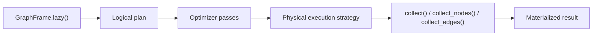

# Lazy Engine

In Lynxes, laziness is not there just to delay work. It exists so that describing the work, optimizing the work, and executing the work do not collapse into the same step.

That separation is one of the reasons the engine can expose a friendly query surface without giving up a real execution boundary underneath.

It is easy to reduce this to "nothing happens until `collect()`," but that description is too thin to be useful. The important thing is not delay by itself. The important thing is that the engine has a period of time in which the query exists as a plan rather than as already-executed graph work. That window is where the system can still reason about the query before it commits to materializing anything.

Without that boundary, a fluent query surface is mostly a style choice. It may read nicely, but each chained method can still collapse straight into work. Lynxes is trying to keep query construction and execution meaningfully separate.

## Eager And Lazy Are Different Promises

The eager surface is for operations where immediate execution is the honest contract. If you call `node_count()`, `edge_count()`, `shortest_path(...)`, or `pagerank()`, the engine should simply do the work and return the result.

The lazy surface is making a different promise. When you call `.lazy()`, you are not asking for a result yet. You are starting to describe one.

That sounds obvious, but it matters. A `GraphFrame` is a graph. A `LazyGraphFrame` is a recipe for producing a result from that graph.

This split exists because different tasks want different interfaces. A shortest-path call is usually clearest as "ask now, get the answer now." A composed traversal that filters, expands, narrows, and then materializes a subgraph benefits from a different shape. Treating both as if they wanted the same interaction model would make one of them awkward.

This is also why Lynxes keeps both surfaces instead of forcing everything through one abstraction. A single universal style can look elegant in a toy example and then turn clumsy once real graph workloads show up.

## What Happens Before `collect()`

Before `collect()` or another materialization call is reached, Lynxes has not produced a concrete subgraph. It is holding a logical representation of the intended work instead.

That matters because a plan can still be reasoned about before the engine commits to materializing anything. It can be simplified, constrained, or otherwise prepared for execution. Without that boundary, every chained call risks turning into immediate graph work whether or not that is sensible.

Graph workloads are especially sensitive to this because expansion can become expensive quickly. If a traversal widens too early or across too much of the graph, the engine may already have paid a large part of the cost before it gets a chance to apply narrower conditions. Once that happens, many possible savings are gone.

By keeping the query in a logical form until collection, Lynxes gives itself a chance to shape the work before it becomes concrete. The exact optimization opportunities can evolve over time, but the existence of that phase boundary is the architectural point.

## The Execution Pipeline

At a high level, the internal flow looks like this:

The details can change over time, but the architectural point stays the same. Lynxes needs a place where it can still reason about the query before graph work is forced.

It helps to read the diagram as a separation of responsibilities. The logical plan is about intent. The optimization stage is where that intent can still be narrowed, rearranged, or simplified while preserving meaning. The physical execution stage is where the engine commits to concrete graph work.

One practical advantage of this split is that the fluent query surface does not have to become the execution model by accident. Users write query-building code in a way that should stay readable. The engine then decides how to carry that intent into execution.

## Why This Boundary Matters For Graph Queries

Graph queries get expensive quickly if expansion happens too early or across too much of the graph. If a query can be narrowed before traversal, that should happen before the engine commits to materializing a large frontier.

That is the practical value of the lazy boundary. It is not just there to support fluent chaining. It preserves enough structure in the user's intent that the engine still has room to avoid unnecessary work.

This is where traversal pruning or predicate pushdown actually belongs. Those ideas only make sense if the engine is still working with a plan.

The alternative is easy to picture because many systems work that way: a method is called, some real data is touched immediately, and the result flows into the next method. That can feel simple for small cases, but it leaves very little room between user intent and engine cost. Once composed graph queries become common, that collapse starts to hurt.

Lynxes is trying to avoid that by taking query construction seriously as its own phase. The lazy layer is not there to make the API look modern. It is there so the engine still has a chance to do sensible things before the graph is actually walked.

## `collect()` Is A Commitment Point

`collect()` is more than a convenience function. It is the point where the user says:

> I no longer want to describe the query. I want the engine to execute it and give me a concrete result.

The materialized result may be a `GraphFrame`, `NodeFrame`, or `EdgeFrame` depending on the collection method. The important part is that planning ends here and execution begins.

This is why `collect()` is worth describing as a boundary rather than merely as a method name. The user is doing more than requesting an object. They are deciding that the query is now concrete enough to materialize. That is part of how Lynxes teaches the user to think about the lazy layer.

There is also an honesty point here. If materialization is a meaningful event, the API should say so explicitly. Hiding that transition behind implicit execution would make the surface look lighter, but it would make performance behavior harder to reason about.

## Readability Still Matters

A common failure mode in lazy systems is to assume that because an optimizer exists, human-readable query structure no longer matters. That should not be the standard here.

Users still have to understand the query they wrote. The optimizer exists to take advantage of real opportunities, not to excuse sloppy or opaque construction.

That may sound like a style note, but it is really a design note. A good lazy API does not turn the user's code into meaningless prelude. The query should still communicate intent to another human. If a query is impossible to read, the existence of a planning layer does not fix the problem.

Lynxes therefore has two responsibilities at once. The query should read clearly enough that users understand what it is asking for. The engine should still retain enough structure that it can execute that query sensibly when the time comes.

## Why Lynxes Keeps Both Eager And Lazy

Lynxes keeps both surfaces because they solve different problems. The eager API is clearer for one-shot graph operations. The lazy API is better when users need composition, controlled materialization, and an explicit execution boundary.

Forcing everything into one style would make the engine harder to explain and harder to optimize.

This is one of those cases where fewer abstractions would not actually make the system simpler. It would just push two different kinds of work into the same shape and ask users to ignore the mismatch. Lynxes is easier to understand once the project admits that some graph operations want to be direct and some want to be planned.

## What This Implies About The Engine

The lazy model only works because Lynxes is willing to define a logical plan layer, an optimization stage, and an execution stage. That is more architecture than a library that simply chains method calls straight into work. It is also the reason the system reads like an engine instead of a collection of helpers.

That extra architecture is not free. It has to be implemented, maintained, and explained. But it also creates the possibility of a cleaner separation between what the user writes and how the engine carries it out. For a project that wants to be more than a bundle of standalone graph utilities, that separation is worth having.

The remaining question is whether these design choices come with meaningful costs. They do.
Continue with [Trade-offs](trade-offs.md).
