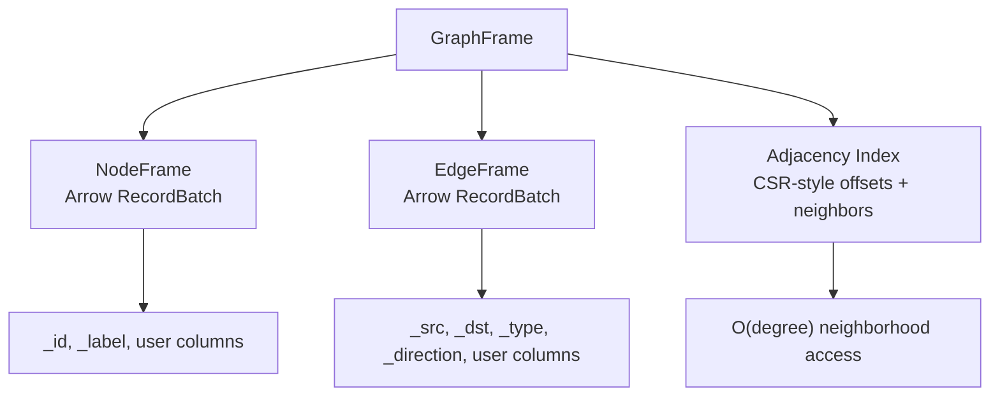

# Memory Layout And CSR

Lynxes makes more sense once you stop reading it as a grab bag of graph helpers and start reading it as an engine with a specific storage model. Most of the public API follows from that model rather than the other way around.

At a high level, the picture is not complicated. Node and edge attributes live in Arrow-native columnar batches. Graph identity comes from reserved columns rather than row position. Traversal starts from a structural index instead of rediscovering adjacency from raw edges whenever someone asks for neighbors.

That summary is simple enough, but it is worth staying with it for a while because a surprising amount of the engine follows from those decisions. The way graphs are loaded, the way they are exposed to Python, the way they move into PyArrow, the reason traversal feels graph-native instead of table-simulated, and even the trade-offs around mutation all start here.

## The Three User-Facing Shapes

Most user-facing work lands in one of three shapes: `GraphFrame`, `NodeFrame`, and `EdgeFrame`.

`GraphFrame` is the whole graph object. It is where payload columns and graph structure are held together. `NodeFrame` and `EdgeFrame` are narrower views for cases where the job is only about nodes or only about edges.

That sounds straightforward, but it matters that these are not just wrappers around detached tables. They are different ways of exposing data that still has graph semantics attached to it.

This is important because users often move between these surfaces in one workflow. They may load a graph, inspect node columns, filter or project a smaller view, expand across edges, and export the result again. If those steps felt like conversions between unrelated representations, the engine would be forcing users to keep translating the same data in their heads. Lynxes is trying to avoid that.

`NodeFrame` and `EdgeFrame` therefore exist because sometimes a narrower surface is useful, not because the engine forgot that the data came from a graph. The graph semantics remain present. The reserved columns remain meaningful. The user is simply working with a smaller view over the same underlying model.

## Graph Identity Is Not The Same As Row Order

In Lynxes, graph identity lives in reserved graph columns rather than in incidental row order.

On the node side that means `_id` and `_label`. On the edge side that means `_src`, `_dst`, `_type`, and `_direction`.

This seems minor until you look at how the engine has to behave. It lets Lynxes use columnar storage without confusing row order for graph semantics. Row order may still matter for display or physical layout, but it is not what makes a node or edge mean what it means.

That has practical consequences almost immediately. Algorithms refer to node identities, not to row numbers. Traversal is defined in terms of endpoints and direction, not whatever ordering the edge batch currently has. Export and round-trip behavior also become easier to reason about when identity is explicit instead of hidden in physical placement.

This is one of those places where a storage detail turns into a semantic detail. If the engine allowed row position to quietly stand in for identity, it might seem convenient at first, but it would become more fragile the moment graphs were filtered, combined, exported, or partially materialized. By keeping identity explicit, Lynxes preserves a cleaner separation between "where the data sits" and "what this node or edge actually is."

## Why Arrow Matters Here

Arrow is not here as a label. It is the payload layout.

That matters because users often want two different kinds of work from the same graph object. They want to traverse the graph, but they also want to inspect payload columns, export results, and move data into the rest of a columnar analytics stack.

Keeping node and edge attributes in Arrow-native batches means Lynxes does not need a second payload model just to become graph-aware. The graph engine and the payload representation stay in the same object model.

This pays off in very ordinary workflows. Users can look at columns, reason about schema, move results into PyArrow, and still stay within the same graph object model. The system does not need to invent a bespoke payload container and then teach users how to convert out of it whenever they want interoperability.

It also imposes some discipline. Once Arrow is the payload representation, the engine has less room to hide behind magical graph containers. It has to be honest about schema, identity columns, and how graph semantics sit on top of ordinary columnar data. That is usually healthier than a design where graph operations are easy to call but the payload becomes opaque the moment it enters the engine.

## Why CSR Matters Just As Much

Arrow by itself does not solve the actual graph problem. If Lynxes only stored edge rows efficiently, it would still have to rediscover adjacency during traversal. That would put the engine back into the same pattern it is trying to avoid.

This is why CSR matters. The engine keeps a structural index so neighborhood access starts from adjacency rather than from repeated edge scanning. The gain is not only the usual `O(degree)` shorthand. More importantly, graph work begins from graph structure.

That difference becomes more important as graph questions repeat. A single ad hoc traversal can tolerate a surprising amount of inefficiency. A workload built around repeated neighborhood access, expansion, or algorithmic passes cannot. At that point, rediscovering structure each time stops feeling simple and starts feeling wasteful.

CSR is a way of admitting what the engine really cares about. Adjacency is not metadata. It is not a convenience derived from the payload on demand. It is one of the primary routes through the graph. Once the system takes that seriously, traversal starts from a structure built for traversal rather than from a generic table representation that happened to contain endpoints.

## A Mental Model For The Data

The following diagram leaves out details, but it captures the relationship that matters most.

The node and edge batches hold the payload. The adjacency index holds the structural shortcut. `GraphFrame` is where those two things are kept together instead of being split across unrelated abstractions.

The diagram is compressed on purpose, but the main point is visible. Lynxes does not ask the user to choose between "the payload representation" and "the graph representation." A graph object contains both. That is what allows the engine to support structural access without giving up a usable columnar surface.

## Memory Layout As A Product Decision

This is not only an implementation detail. It is part of the product definition.

Lynxes is making a few decisions up front: graph structure should not be rebuilt from scratch on every traversal, payloads should already be columnar, and results should stay near that representation when possible. Once those decisions are fixed, a lot of the rest of the engine follows from them.

This is the sense in which memory layout becomes a product decision rather than a hidden optimization. If a project wants graph traversal to feel native and also wants payloads to remain interoperable with Arrow-oriented tooling, the layout is no longer an internal afterthought. It becomes one of the main constraints shaping the entire system.

The benefit of being explicit about this is that other design choices stop looking arbitrary. Reserved graph columns, structural indexing, result materialization, and even the distinction between eager and lazy surfaces all make more sense once you see the layout as part of the public model rather than as an implementation detail buried below it.

## What Users Feel From This Design

From the outside, this mostly shows up in ordinary usage. Traversal-oriented operations feel graph-native. Inspection-oriented work still feels natural in a frame-like surface. PyArrow interop does not require much of a conceptual jump. Reserved graph columns matter more than row order.

That is the practical value of the layout. It lets structural analytics and payload analytics live in the same engine without forcing one to pretend it is the other.

Users may not describe the benefit in terms of CSR or Arrow buffers, but they usually notice it when a workflow stays coherent. They can load a graph, inspect attributes, traverse outward, run an algorithm, and export the result without feeling like they crossed representation boundaries several times. That coherence is the user-facing version of the storage model.

## What This Design Refuses To Pretend

This layout is powerful, but it is also opinionated. It assumes that maintaining a structural index is worth the cost. It assumes that batch-oriented or relatively stable graph handling is a reasonable target. It assumes that adjacency-driven access deserves to be privileged over ad hoc edge scanning.

Those assumptions are what make the engine coherent for its target workloads. They are also where the limitations start.

That is fine as long as it is stated directly. One of the easiest mistakes in systems work is to smooth out every sharp edge in the documentation until the system sounds universal. Lynxes is easier to understand if it admits that it values structural access and columnar payloads enough to shape the engine around them. That narrows the tool, but it also makes the design legible.

The next page explains how these layout decisions continue into execution.
Continue with [Lazy engine](lazy-engine.md).
